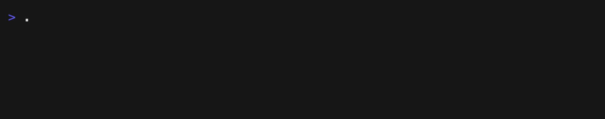

# timer-cli: Terminal countdown timer

Run a countdown in the terminal and see when it ends, how much time remains,
and how far along it is.



## Usage

```text
timer-cli DURATION [options]

timer-cli 10m
timer-cli 1h30m --title "Focus Session"
timer-cli 01:30:00
timer-cli 5 minutos --lang es
timer-cli 5m --fullscreen --controls
timer-cli 25m --loop
timer-cli 30s --json
```

Run `timer-cli --help` to see the full command reference.

### Options

| Option | Effect |
| --- | --- |
| `--title TEXT` | Show a title next to the countdown. |
| `--message TEXT` | Text printed when the timer completes. |
| `--fullscreen` | Use the large-digit fullscreen display. |
| `--controls` | Add the key legend to the fullscreen display. It has no effect in the default compact view. |
| `--loop` | Restart from the original duration after every completion. |
| `--no-bell` | Never send the terminal bell. |
| `--bell-count N` | Send the completion bell `N` times (1 to 3, default 1). |
| `--final-only` | Suppress intermediate output; print only the final message. |
| `--quiet`, `-q` | Print no regular output at all. |
| `--json` | Print exactly one JSON object after the timer finishes. |
| `--ascii` | Draw the progress bar with `#` and `-`. |
| `--lang LANG` | Interface language: `auto` (default), `en`, or `es`. |
| `--help`, `-h` | Show help. |
| `--version` | Show version information. |

`--final-only`, `--quiet`, and `--json` are mutually exclusive, and `--loop`
cannot be combined with `--json`.

Completion bells are TTY-only, and `--json` disables the bell automatically. A
terminal decides whether each standard BEL character is audible, visual, or
muted, so multiple bell characters may not produce distinct sounds. The
display uses no color, so it already follows `NO_COLOR`.

### Interactive controls

Controls are available while both stdin and stdout are terminals:

- **Space** pauses or resumes.
- **R** restarts the original duration.
- **+** adds one minute, never above the 30-day maximum.
- **-** subtracts one minute, never below zero.
- **Q**, **Escape**, or **Ctrl+C** cancels without a completion alert.

After a non-looping compact timer completes, its 100% frame and completion
message remain visible in the terminal. Loop and fullscreen displays continue
to clean up or redraw their live frames.

## Durations

The parser accepts three forms:

- Ordered whole-number units: `h`, then `m`, then `s`, such as `1h 30m`.
- Whole-number unit words in any language listed below. Words are
  case-insensitive, and the listed conjunction is optional. Units must remain
  in `h`, `m`, `s` order. Multi-word durations do not need shell quotes.
- Colon notation: exactly `MM:SS` or `HH:MM:SS`. `MM:SS` fields are two
  digits. `HH:MM:SS` hours use two or three digits; minutes and seconds are
  `00`-`59`.

| Language | Hours | Minutes | Seconds | Conjunction |
| --- | --- | --- | --- | --- |
| English | `hour`/`hours` | `minute`/`minutes` | `second`/`seconds` | `and` |
| Spanish | `hora`/`horas` | `minuto`/`minutos` | `segundo`/`segundos` | `y` |
| Portuguese | `hora`/`horas` | `minuto`/`minutos` | `segundo`/`segundos` | `e` |
| French | `heure`/`heures` | `minute`/`minutes` | `seconde`/`secondes` | `et` |
| German | `Stunde`/`Stunden` | `Minute`/`Minuten` | `Sekunde`/`Sekunden` | `und` |
| Italian | `ora`/`ore` | `minuto`/`minuti` | `secondo`/`secondi` | `e` |
| Dutch | `uur`/`uren` | `minuut`/`minuten` | `seconde`/`seconden` | `en` |

Durations must be at least one second and at most 30 days. Negative,
fractional, zero, malformed, and ambiguous values are rejected with exit
code 2.

## Install

Prebuilt `timer-cli` release archives are available for macOS and Linux on
`amd64` and `arm64`. Native Windows is not supported.

Install with Homebrew on macOS or Linux:

```sh
brew install onlinealarmkur/tools/timer-cli
```

On Linux distributions with snapd:

```sh
sudo snap install timer-cli
```

Or install the exact release from source with Go 1.26 or newer:

```sh
go install github.com/onlinealarmkur/timer-cli/cmd/timer-cli@v1.0.0
```

### Manual install

Each release provides four direct-install archives, `SHA256SUMS`, and GitHub
provenance attestations. Archive names use `darwin` for macOS and `linux` for
Linux. Intel/x86-64 is `amd64`, while Apple Silicon/AArch64 is `arm64`.
Download the matching archive and manifest from the same release:

```sh
VERSION=1.0.0
TARGET=darwin_arm64
ARCHIVE="timer-cli_${VERSION}_${TARGET}.tar.gz"
RELEASE_URL="https://github.com/onlinealarmkur/timer-cli/releases/download/v${VERSION}"

curl --fail --location --remote-name "${RELEASE_URL}/${ARCHIVE}"
curl --fail --location --remote-name "${RELEASE_URL}/SHA256SUMS"
```

Verify the downloaded archive. This command uses `sha256sum` when available,
as it normally is on Linux. Otherwise, it uses the `shasum` included with
macOS:

```sh
CHECKSUM_LINE="$(awk -v archive="$ARCHIVE" '$2 == archive { print }' SHA256SUMS)"
if command -v sha256sum >/dev/null 2>&1; then
  test -n "$CHECKSUM_LINE" &&
    printf '%s\n' "$CHECKSUM_LINE" | sha256sum -c -
else
  test -n "$CHECKSUM_LINE" &&
    printf '%s\n' "$CHECKSUM_LINE" | shasum -a 256 -c -
fi
```

You can also verify the archive's GitHub attestation:

```sh
gh attestation verify "$ARCHIVE" --repo onlinealarmkur/timer-cli
```

Extract the archive and install it in a user-writable directory. `~/.local/bin`
is a common choice; set `INSTALL_DIR` to use another directory:

```sh
TOP_DIR="${ARCHIVE%.tar.gz}"
INSTALL_DIR="${INSTALL_DIR:-$HOME/.local/bin}"
tar -xzf "$ARCHIVE"
mkdir -p "$INSTALL_DIR"
install -m 0755 "${TOP_DIR}/timer-cli" "${INSTALL_DIR}/timer-cli"
```

Confirm the command is discoverable and reports its version:

```sh
export PATH="$INSTALL_DIR:$PATH"
command -v timer-cli
timer-cli version
```

To make this `PATH` change permanent, add the export to your shell
configuration. After installation, see [Shell completion](#shell-completion).

## Shell completion

The completion command prints a script to stdout and does not edit your shell
profile or install files. To activate it for the current session:

```sh
# Bash
source <(timer-cli completion bash)

# zsh
autoload -Uz compinit && compinit -d /dev/null
source <(timer-cli completion zsh)

# fish
timer-cli completion fish | source
```

For persistent completion, save the generated script in a user-owned completion
directory supported by your shell, then configure the shell to load it. The
generated candidates follow the parser's rules and do not suggest rejected
combinations such as `--loop --json` or `--quiet --final-only`.

## Interface language

The interface is available in English and Spanish. `--lang` accepts `auto`,
`en`, or `es`. With the default `auto`, `timer-cli` checks `LC_ALL`, then
`LC_MESSAGES`, then `LANG`. `C`, `POSIX`, empty, and unsupported locales fall
back to English. An explicit `en` or `es` overrides the environment.

```sh
timer-cli 5m --lang es
timer-cli --lang es --help
LC_ALL=es_ES.UTF-8 timer-cli 5m
```

With Spanish selected, the display becomes:

```text
Té · termina a las 22:53 · quedan 00:42
████████████████░░░░░░░░░░░░  60%
```

Duration vocabulary and interface language are independent:
`timer-cli 5 minutos --lang en` accepts the Spanish unit but keeps English
output. This prevents words shared by several languages from changing the
interface language.

Interface text, help, validation errors, shell-completion descriptions, and
default completion and cancellation messages follow the selected language.
User-provided titles and `--message` values are not translated.

Terminal output replaces invalid UTF-8 and removes unsafe control and
bidirectional-formatting characters. JSON retains valid UTF-8 input with
standard JSON escaping.

JSON field names, status values, and redirected `remaining=...` record keys
remain stable and are never translated.

## Terminal behavior

When stdout is a TTY, the display updates in place and restores cursor and raw
keyboard state on completion or cancellation. Fullscreen mode redraws after a
terminal resize and falls back to compact mode when the terminal is too small.

The title is shortened by terminal display cells as needed; narrower terminals
use a one-line fallback, and a terminal shorter than two rows does the same.
Paused timers always show the localized paused state and hide the projected
end time until they resume. Progress stays below 100% until completion.
Unicode terminals use `█` and `░`; `--ascii`, `TERM=dumb`, and exact
`C`/`POSIX` locales use `#` and `-`.

`TERM=dumb` also disables cursor-control rendering and uses the same plain,
non-ANSI countdown records as redirected output. Keyboard controls and the
optional terminal bell remain available when stdin and stdout are terminals.

### Redirected output

When stdout is redirected, `timer-cli` writes no ANSI sequences or terminal
bell bytes. With the default output, it writes periodic records at this
cadence:

| Effective timer duration | Record interval |
| --- | --- |
| Up to 1 hour | Each remaining second |
| Over 1 hour and up to 24 hours | Each remaining minute |
| Over 24 hours | Every 10 minutes |

In regular redirected output, the first record, the zero-remaining completion
record, and paused or running transitions are always written. Duplicate
snapshots within the same interval are suppressed. The timer waits until the
next record boundary or completion without delaying cancellation or keyboard
input. Rounded-up records never show zero before completion.

### Looping

`--loop` starts a fresh countdown from the originally requested duration after
each successful completion. Normal and final-only modes print the configured
completion message after every cycle. Quiet mode suppresses regular text. On a
TTY, the configured bell still applies unless it is disabled. Interactive time
adjustments affect only the current cycle. **Q**, **Escape**, **Ctrl+C**, or
process termination stops the loop without another completion alert.

Looping works with plain, fullscreen, final-only, and quiet output, but not
with `--json`, which must produce exactly one result. In fullscreen mode, the
completion notice remains visible in the restarted frame for one second
without delaying the next cycle. If the computer sleeps through several
potential cycles, `timer-cli` completes the observed cycle once and starts one
new full cycle. It does not replay missed alerts.

### JSON result and exit codes

The JSON object contains `status` (`completed` or `canceled`), the effective
adjusted total in `duration_seconds`, the originally requested duration in
`initial_duration_seconds`, elapsed time in `elapsed_seconds`, optional
`title`, the completion `message`, and the UTC RFC 3339 finish time in
`finished_at`.

Exit codes are 0 for completion and informational commands, 1 for runtime I/O
failure, 2 for invalid usage, and 130 for intentional cancellation. When a
pipeline consumer closes its input early, the shell may instead report the
conventional SIGPIPE status 141; that is expected for a closed pipeline.

## Timing model

The countdown stores an absolute wall-clock target and recalculates the
remaining time on every render instead of decrementing a counter. Scheduling
delays and forward wall-clock jumps after sleep or wake do not accumulate
drift. If wall time moves backward, the target is rebased by the same correction
so the timer does not undo already observed elapsed time. Remaining, elapsed,
and total time stay consistent. Remaining time is clamped at zero, completion
is delivered once per completed cycle, and tests use an injected clock.

## Scope and privacy

`timer-cli` runs one countdown in the foreground and does not save history or
configuration. It does not schedule alarms for dates or clock times, and it
has no daemon, Pomodoro tracking, accounts, telemetry, cloud sync, or network
access. It does not download sounds, run commands, or send desktop
notifications.

Titles and completion messages live only in process memory and terminal
output. Your shell history, terminal scrollback, redirected files, pipelines,
or log collectors may still retain the command or its output. Do not put
sensitive text in a title or message unless you trust those systems.

## Development

Use the Go toolchain recorded in `.go-version` and install ShellCheck. Both must
be available on `PATH`; set `GO` or `SHELLCHECK` to an explicit executable path
when needed.

```sh
make all
make build
make coverage
```

`make all` runs the full local check:

- Formatting, module graph, tidy-diff, and license checks.
- The module-pinned `govulncheck`, vet, staticcheck, ShellCheck, and workflow
  linting.
- Release-guard tests, regular tests, race tests, and the 95% aggregate
  coverage check.
- A local build.

The vulnerability scan used in development and CI consults the Go
vulnerability database. The compiled `timer-cli` runtime makes no network
requests.

On Linux, release-tooling changes also use `make package-check`. Release
packaging requires the exact Go toolchain recorded in `.go-version`, and
`make package` reads the product version from the source. Deterministic
packaging requires GNU tar and GNU date, so it runs in Linux CI and release
jobs rather than a default macOS environment.

`make coverage` writes the ignored `coverage.out` profile and prints coverage
for each function.

For each release tag, the workflow generates a Homebrew formula, an AUR
submission bundle, a vendored source archive, and native `amd64` and `arm64`
snaps. Homebrew and AUR use the version and SHA-256 checksum from the same
verified source archive, and each snap contains the tested Linux binary for
its architecture. Publishing to the Homebrew tap, AUR, and Snap Store is a
separate maintainer step.

## Online timer

Use the [Online Alarm Kur timer](https://onlinealarmkur.com/timer/en/) in a web
browser.

## License

MIT. See [LICENSE](LICENSE).
